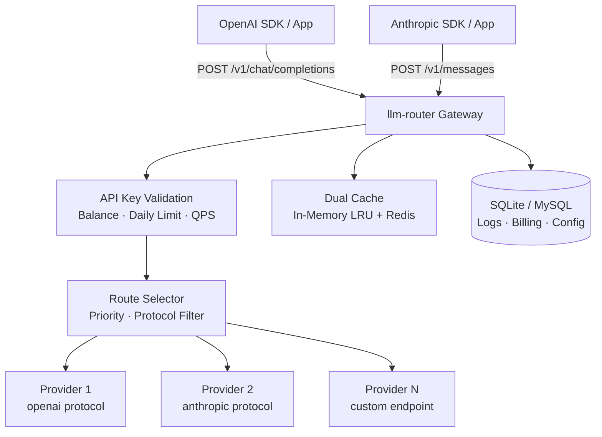
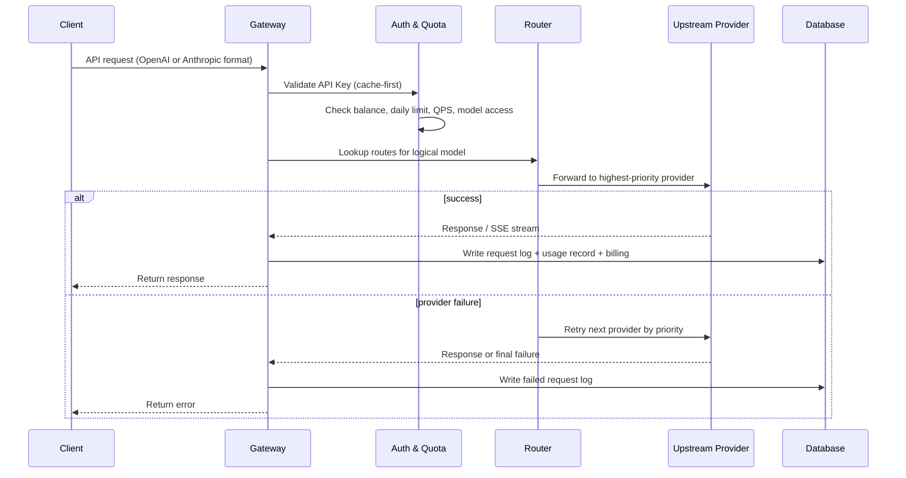
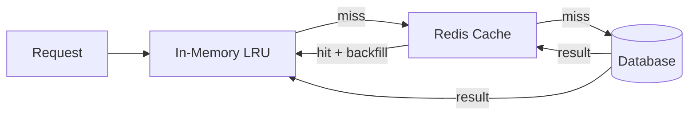

# LLM Router

> A lightweight yet production-ready LLM gateway — start with one Docker command and SQLite, scale to MySQL + Redis without changing a line of application code.

**Drop-in compatible** with the OpenAI and Anthropic API. Point your existing SDK at `http://your-host/v1` and it just works.

[中文文档](README.zh-CN.md)

---

## Quick Start

### Local mode with SQLite

```bash
docker run -d \
  --name llm-router \
  -p 8000:8000 \
  -e APP_ENCRYPTION_KEY="your-fernet-key" \
  -e SESSION_SECRET="your-session-secret" \
  liuzhenghua/llm-router:latest
```

Open the admin panel and follow the setup guide to create the first admin account:

[http://localhost:8000/admin/login](http://localhost:8000/admin/login)

### Server Mode

Use MySQL and Redis for multi-instance or production deployments.

```bash
docker run -d \
  --name llm-router \
  -p 8000:8000 \
  -e APP_ENCRYPTION_KEY="your-fernet-key" \
  -e SESSION_SECRET="your-session-secret" \
  -e MYSQL_URL="mysql://llm_router@mysql:3306/llm_router" \
  -e MYSQL_PASSWORD="your-mysql-password" \
  -e REDIS_URL="redis://redis:6379/0" \
  liuzhenghua/llm-router:latest
```

> Fresh installs create tables automatically on first startup. Existing deployments should apply the versioned SQL files under `migrations/` when upgrading across schema changes.

### Required Environment Variables

| Variable | Required | Description |
|---|---|---|
| `APP_ENCRYPTION_KEY` | Yes | Fernet key used to encrypt upstream provider API keys |
| `SESSION_SECRET` | Yes | Secret used for admin session cookies |
| `TZ` | No | Timezone for billing date and daily budget reset, default `UTC` |
| `MYSQL_URL` | No | Enable MySQL storage |
| `MYSQL_PASSWORD` | No | MySQL password |
| `REDIS_URL` | No | Enable Redis cache, queue, and distributed lock |
| `REDIS_PASSWORD` | No | Redis password |
| `TABLE_PREFIX` | No | Optional table prefix, for example `lr_` |

### SDK Usage

Use it as a drop-in OpenAI-compatible gateway:

```python
from openai import OpenAI

client = OpenAI(
    base_url="http://your-host/v1",
    api_key="your-llm-router-key",
)

response = client.chat.completions.create(
    model="gpt-4o",
    messages=[{"role": "user", "content": "Hello"}],
)
```

Or as an Anthropic-compatible gateway:

```python
import anthropic

client = anthropic.Anthropic(
    base_url="http://your-host/anthropic",
    api_key="your-llm-router-key",
)

message = client.messages.create(
    model="claude-3-5-sonnet",
    max_tokens=1024,
    messages=[{"role": "user", "content": "Hello"}],
)
```

---

| | Local mode | Server mode |
|---|---|---|
| Storage | SQLite (file, zero setup) | MySQL (shared across instances) |
| Cache | In-memory LRU | In-memory LRU + Redis |
| Deployment | Single process | Multi-instance / containerized |
| Dependencies | None | MySQL + Redis |

---

## Features

- **Protocol compatibility** — serves OpenAI `POST /v1/chat/completions`, `POST /v1/embeddings`, `GET /v1/models` and Anthropic `POST /anthropic/v1/messages`, `GET /anthropic/v1/models`
- **Logical model routing** — expose a stable model name (e.g. `gpt-4o`) and route it to any number of real backend providers
- **Priority fallback** — if the top-priority provider fails, the gateway automatically tries the next one
- **Production stability** — cache-first validation, graceful Redis degradation, request compatibility fixes, and hardened protocol conversion paths help keep the gateway stable in real production traffic
- **Per-key quota control** — balance, daily spend cap, QPS limit, and allowed-model list per API key
- **Per-key timezone** — each API key carries an IANA timezone (`Asia/Shanghai`, `UTC`, …) used for billing-date calculation and daily budget reset
- **Accurate billing** — per-request cost breakdown: input, output, cache-read, cache-write, and reasoning tokens, priced at creation time so history is never affected by price changes
- **Statistics dashboard** — observe runtime health, request volume, latency, token usage, cost, channels, users, models, providers, and error categories from the admin panel
- **Prompt cache awareness** — handles `cache_read_tokens` and `cache_write_tokens` so cached tokens are never double-billed
- **Reasoning token tracking** — captures `reasoning_tokens` from supported models and includes them in usage records and daily summaries
- **Request attribution headers** — tag requests with `x-end-user` and `x-channel` headers for request-log filtering, cost attribution, and multi-dimensional statistics; `x-channel` falls back to the API key's `default_channel`
- **Error categorization** — separates client-side errors from router/upstream errors, making production health monitoring and troubleshooting much clearer
- **Fast issue diagnosis** — request logs can be filtered by user, channel, model, provider, status, and error class; request details keep the context needed to locate failures quickly
- **Model-source payload overrides** — configure payload overrides per provider model, useful for disabling thinking/reasoning modes or adapting upstream-specific request fields
- **Image-stripping fallback support** — optionally remove image content before forwarding to an upstream model source, so a non-multimodal source can safely serve as a fallback route for a multimodal source
- **Streaming support** — transparent SSE pass-through for both OpenAI and Anthropic streaming
- **Audit logging** — optional per-key request/response content capture; metadata always recorded
- **Multi-language admin UI** — switch the admin interface between supported languages for operators in different teams
- **Flexible deployment** — defaults to SQLite + in-memory cache with zero external dependencies; set `MYSQL_URL` and/or `REDIS_URL` to scale to multi-instance, production deployments — same codebase, no code changes required
- **Built-in admin panel** — manage keys, providers, routes, and view logs and billing without any extra tooling

---

## Screenshots

### Dashboard — real-time overview of requests, balance, and daily spend


### Statistics — observe traffic, cost, latency, channels, users, and error classes


### Logical Models & Routes — map a model name to one or more backend providers with priority fallback


### Request Detail — token breakdown, cost split, latency, error class, and optional full content log


---

## Developer Setup

### 1. Install dependencies

```bash
uv sync
```

### 2. Configure environment

```bash
cp .env.example .env
# Edit .env — set APP_ENCRYPTION_KEY and SESSION_SECRET at minimum
```

### 3. Start the server

```bash
uv run uvicorn llm_router.main:app --reload
```

For breakpoint debugging:

```bash
uv run python -m llm_router.main
```

### 4. Open the admin panel

Open the admin panel and follow the setup guide to create the first admin account:

[http://127.0.0.1:8000/admin/login](http://127.0.0.1:8000/admin/login)

### Docker Compose for local development

SQLite mode:

```bash
cd docker/local
docker compose up --build
```

MySQL + Redis mode:

```bash
cd docker/server
docker compose up --build
```

---

## Configuration Reference

The required deployment variables are listed in Quick Start. See `.env.example` for the full set of supported settings, including local database paths, logging options, admin UI behavior, cache settings, and provider defaults.

---

## Core Concepts

### Logical Model

The model name your clients send (e.g. `gpt-4o`, `claude-sonnet`, `my-internal-model`). Clients never need to know which actual provider is behind it.

### Provider Model

A concrete upstream endpoint — provider type, protocol (`openai` or `anthropic`), model name, API key, and per-million-token pricing.

### Route

A mapping from a logical model to one or more provider models, each with a priority. The gateway selects by priority and falls back automatically on failure.

### Channel

An optional string tag attached to each request for analytics and cost attribution. Set via the `x-channel` HTTP header per request, or configure a `default_channel` on the API key as a fallback.

### End User

An optional end-user identifier attached to each request via the `x-end-user` HTTP header. It is recorded in request logs and statistics, making it easier to filter usage, diagnose user-specific failures, and understand cost distribution.

### Error Class

Request failures are categorized as either client-side errors or router/upstream errors. This keeps user/request compatibility issues separate from gateway or provider health signals, which makes the request log and statistics dashboard more useful in production.

---

## API Compatibility

| Endpoint | Protocol | Streaming |
|---|---|---|
| `POST /v1/chat/completions` | OpenAI | ✅ SSE |
| `POST /v1/embeddings` | OpenAI | — |
| `GET /v1/models` | OpenAI | — |
| `GET /v1/models/{model_id}` | OpenAI | — |
| `POST /anthropic/v1/messages` | Anthropic | ✅ streaming |
| `GET /anthropic/v1/models` | Anthropic | — |
| `GET /anthropic/v1/models/{model_id}` | Anthropic | — |

The Anthropic-compatible endpoints accept authentication via either:
- `Authorization: Bearer <key>` — standard Bearer token
- `x-api-key: <key>` — native Anthropic SDK style

Optional attribution headers accepted by both OpenAI-compatible and Anthropic-compatible endpoints:
- `x-end-user` — end-user identifier for log filtering and user-level statistics
- `x-channel` — traffic channel for analytics and cost attribution

---

## Database Migrations

Fresh installs create tables automatically on first startup. For existing deployments, apply the versioned SQL migration files under `migrations/` when upgrading across schema changes.

Migration files are provided for both MySQL and SQLite:

```bash
mysql -u llm_router -p llm_router < migrations/<version>/migration_mysql_<version>.sql
sqlite3 data/llm_router.db < migrations/<version>/migration_sqlite_<version>.sql
```

---

## Project Structure

```
llm-router/
  src/llm_router/
    api/          # FastAPI route handlers (openai, anthropic, admin)
    core/         # Config, database, security
    domain/       # ORM models, schemas, enums
    services/     # Gateway, router, billing, cache, streaming handlers
    templates/    # Jinja2 admin UI templates
  docker/
    local/        # SQLite Compose
    server/       # MySQL Compose + init.sql
  docs/
    architecture/ # Architecture documentation
    tests/
```

---

## Architecture

### System Overview



### Request Lifecycle



### Dual Cache (In-Memory + Redis)



The cache stores API key metadata and route configurations. Redis is optional — if unreachable, the gateway falls back to in-memory transparently.

---

## License

AGPLv3
