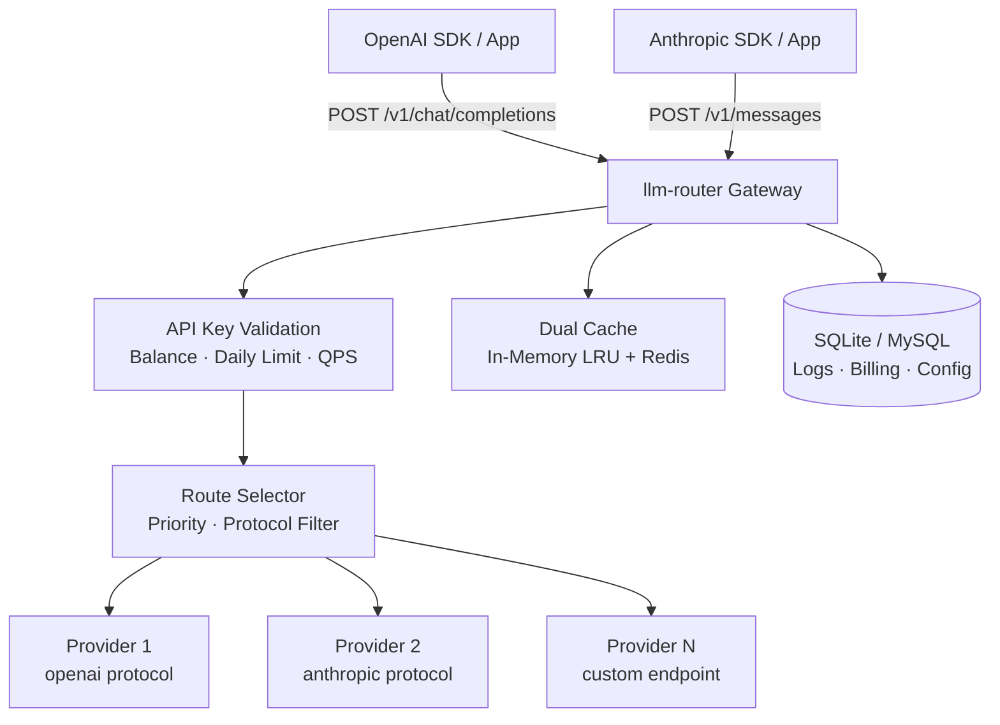
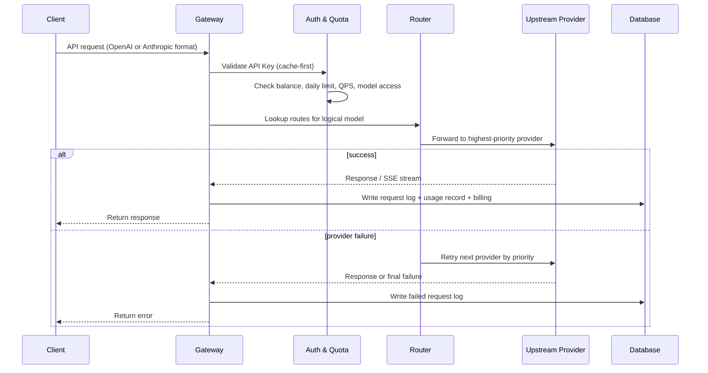
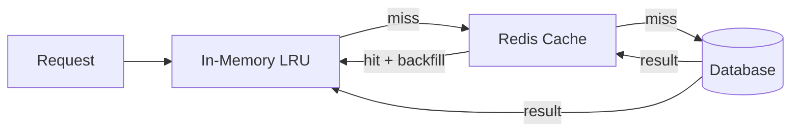

# LLM Router

> A lightweight yet production-ready LLM gateway — start with a single `uv run` and SQLite, scale to MySQL + Redis without changing a line of application code.

**Drop-in compatible** with the OpenAI and Anthropic API. Point your existing SDK at `http://your-host/v1` and it just works.

| | Local mode | Server mode |
|---|---|---|
| Storage | SQLite (file, zero setup) | MySQL (shared across instances) |
| Cache | In-memory LRU | In-memory LRU + Redis |
| Deployment | Single process | Multi-instance / containerized |
| Dependencies | None | MySQL + Redis |

---

## Screenshots

### Dashboard — real-time overview of requests, balance, and daily spend


### Logical Models & Routes — map a model name to one or more backend providers with priority fallback


### Request Detail — per-request token breakdown, cost split, latency, and optional full content log


---

## Features

- **Protocol compatibility** — serves OpenAI `POST /v1/chat/completions` and Anthropic `POST /v1/messages`
- **Logical model routing** — expose a stable model name (e.g. `gpt-4o`) and route it to any number of real backend providers
- **Priority fallback** — if the top-priority provider fails, the gateway automatically tries the next one
- **Per-key quota control** — balance, daily spend cap, QPS limit, and allowed-model list per API key
- **Accurate billing** — per-request cost breakdown: input, output, cache-read, and cache-write, priced at creation time so history is never affected by price changes
- **Prompt cache awareness** — handles `cache_read_tokens` and `cache_write_tokens` so cached tokens are never double-billed
- **Streaming support** — transparent SSE pass-through for both OpenAI and Anthropic streaming
- **Audit logging** — optional per-key request/response content capture; metadata always recorded
- **Two deployment modes** — `local` (SQLite + in-memory cache, zero external dependencies) for instant startup; `server` (MySQL + Redis) for multi-instance, production-scale deployments — same codebase, just flip `APP_MODE`
- **Built-in admin panel** — manage keys, providers, routes, and view logs and billing without any extra tooling

---

## Architecture

### System Overview



### Request Lifecycle



### Dual Cache (In-Memory + Redis)



The cache stores API key metadata and route configurations. Redis is optional — if unreachable, the gateway falls back to in-memory transparently.

---

## Quick Start

### 1. Install dependencies

```bash
uv sync
```

### 2. Configure environment

```bash
cp .env.example .env
# Edit .env — set APP_ENCRYPTION_KEY and SESSION_SECRET at minimum
```

### 3. Create an admin account

```bash
uv run llm-router init-admin --username admin --password your-password
```

### 4. Start the server

```bash
uv run uvicorn llm_router.main:app --reload
```

For breakpoint debugging:

```bash
uv run python -m llm_router.main
```

### 5. Open the admin panel

[http://127.0.0.1:8000/admin/login](http://127.0.0.1:8000/admin/login)

---

## Docker

### Local mode (SQLite — zero dependencies)

```bash
cd docker/local
docker compose up --build
```

Then create an admin account:

```bash
docker compose exec llm-router uv run llm-router init-admin --username admin --password your-password
```

### Server mode (MySQL + Redis)

```bash
cd docker/server
docker compose up --build
```

Then create an admin account:

```bash
docker compose exec llm-router uv run llm-router init-admin --username admin --password your-password
```

> Tables are created automatically on first startup via `Base.metadata.create_all`. No manual migration step needed.

---

## Configuration

Key environment variables (see `.env.example` for the full list):

| Variable | Description |
|---|---|
| `APP_MODE` | `local` (SQLite) or `server` (MySQL) |
| `APP_ENCRYPTION_KEY` | Fernet key used to encrypt upstream provider API keys |
| `SESSION_SECRET` | Secret for admin session cookies |
| `DATABASE_URL` | SQLAlchemy DB URL (auto-set in Docker Compose) |
| `REDIS_URL` | Redis URL — optional, only used in `server` mode |
| `TABLE_PREFIX` | Optional prefix for all table names, e.g. `lr_` → `lr_api_keys` |
| `LOG_LEVEL` | Logging verbosity |

---

## Core Concepts

### Logical Model

The model name your clients send (e.g. `gpt-4o`, `claude-sonnet`, `my-internal-model`). Clients never need to know which actual provider is behind it.

### Provider Model

A concrete upstream endpoint — provider type, protocol (`openai` or `anthropic`), model name, API key, and per-million-token pricing.

### Route

A mapping from a logical model to one or more provider models, each with a priority. The gateway selects by priority and falls back automatically on failure.

---

## API Compatibility

| Endpoint | Protocol | Streaming |
|---|---|---|
| `POST /v1/chat/completions` | OpenAI | ✅ SSE |
| `POST /v1/messages` | Anthropic | ✅ streaming |

Usage with the OpenAI Python SDK:

```python
from openai import OpenAI

client = OpenAI(
    base_url="http://your-host/v1",
    api_key="your-llm-router-key",
)

response = client.chat.completions.create(
    model="gpt-4o",   # your logical model name
    messages=[{"role": "user", "content": "Hello"}],
)
```

---

## Project Structure

```
llm-router/
  src/llm_router/
    api/          # FastAPI route handlers (openai, anthropic, admin)
    core/         # Config, database, security
    domain/       # ORM models, schemas, enums
    services/     # Gateway, router, billing, cache, streaming handlers
    templates/    # Jinja2 admin UI templates
  docker/
    local/        # SQLite Compose
    server/       # MySQL Compose + init.sql
  docs/
    architecture/ # Architecture documentation
    tests/
```

---

## License

MIT
