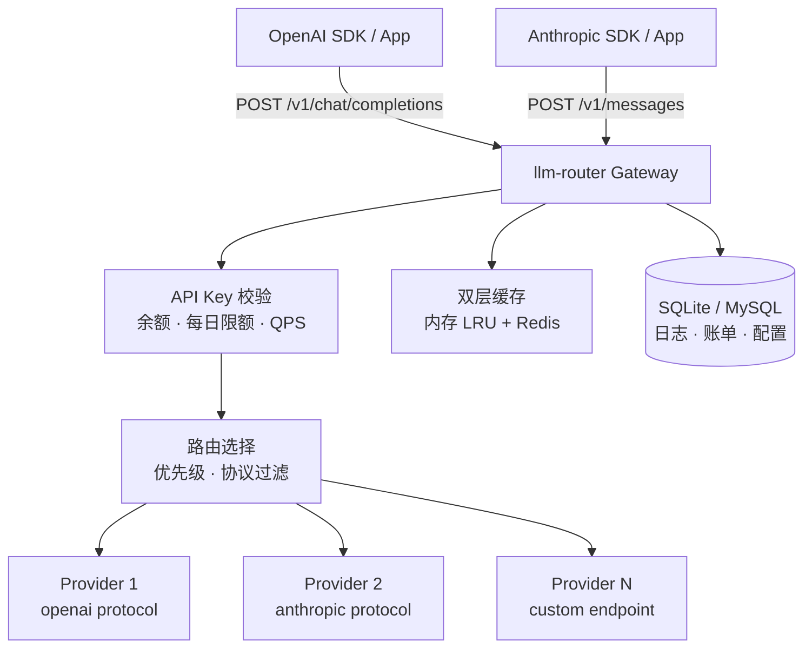
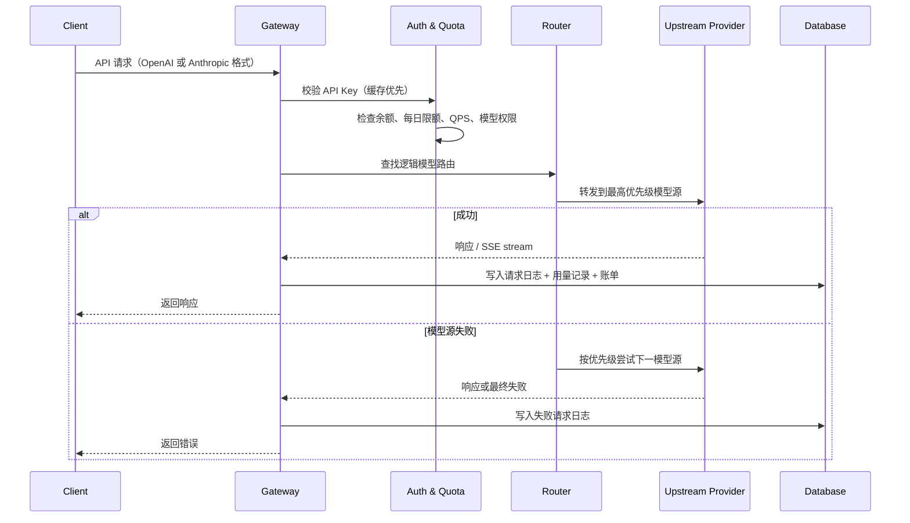
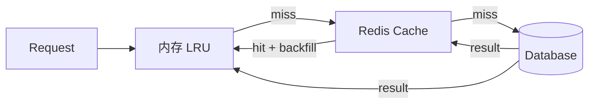

# LLM Router

> 一个轻量但面向生产环境的 LLM 网关：本地用 `uv run` + SQLite 即可启动，生产环境可平滑扩展到 MySQL + Redis，无需改业务代码。

**兼容 OpenAI 和 Anthropic API**。把现有 SDK 的 base URL 指向 `http://your-host/v1`，即可通过统一网关访问后端模型。

[English](README.md)

| | 本地模式 | 服务端模式 |
|---|---|---|
| 存储 | SQLite（文件，零依赖） | MySQL（多实例共享） |
| 缓存 | 内存 LRU | 内存 LRU + Redis |
| 部署 | 单进程 | 多实例 / 容器化 |
| 依赖 | 无 | MySQL + Redis |

---

## 截图

### Dashboard — 实时查看请求、余额和每日花费


### Statistics — 统计请求、成本、延迟、渠道、用户和错误类型


### Logical Models & Routes — 将一个模型名路由到多个后端供应商，并支持优先级 fallback


### Request Detail — 查看 token、成本、延迟、错误类型和可选的完整内容日志


---

## 特性

- **协议兼容** — 支持 OpenAI `POST /v1/chat/completions`、`POST /v1/embeddings`、`GET /v1/models`，以及 Anthropic `POST /anthropic/v1/messages`、`GET /anthropic/v1/models`
- **逻辑模型路由** — 对客户端暴露稳定模型名（如 `gpt-4o`），后端可路由到任意真实模型源
- **优先级 fallback** — 高优先级模型源失败时，自动尝试下一条路由
- **生产稳定性** — 缓存优先校验、Redis 优雅降级、请求兼容性修复和更稳健的协议转换，让系统可以稳定承载生产流量
- **API Key 级额度控制** — 支持余额、每日花费上限、QPS 限制和允许访问的模型列表
- **API Key 级时区** — 每个 API Key 可配置 IANA 时区（如 `Asia/Shanghai`、`UTC`），用于账单日期计算和每日预算重置
- **精确计费** — 按请求记录 input、output、cache-read、cache-write、reasoning tokens 的成本明细；价格在请求发生时固化，历史账单不受价格调整影响
- **统计看板** — 在后台查看运行状态、请求量、延迟、token 用量、成本、渠道、用户、模型、供应商和错误分类
- **Prompt cache 感知** — 识别 `cache_read_tokens` 和 `cache_write_tokens`，避免缓存 token 被重复计费
- **Reasoning token 统计** — 记录支持模型返回的 `reasoning_tokens`，并纳入请求日志和每日汇总
- **请求归因 Header** — 通过 `x-end-user` 和 `x-channel` 标记请求，便于过滤请求日志、归因成本和做多维统计；`x-channel` 可回退到 API Key 的 `default_channel`
- **错误分类** — 区分客户端错误与 router/upstream 错误，方便监测线上稳定性，并快速判断问题来自调用方、网关还是上游模型源
- **快速定位问题** — 请求日志支持按用户、渠道、模型、供应商、状态和错误类型过滤；日志详情保留定位问题所需的上下文
- **模型源 Payload Override** — 支持为模型源配置请求 payload 覆盖，便于关闭 thinking/reasoning 模式或适配不同上游字段
- **移除上游图片内容** — 模型源可配置 `Remove image content before upstream`，当非多模态模型源作为多模态模型源的 fallback 时，可以先移除图片内容再转发
- **流式输出** — OpenAI 与 Anthropic 流式响应均支持透明 SSE 转发
- **审计日志** — 可按 API Key 开启请求/响应内容记录；元数据始终记录
- **多语言后台** — 后台管理界面支持多语言切换，方便不同团队成员使用
- **灵活部署** — 默认 SQLite + 内存缓存，无外部依赖；设置 `MYSQL_URL` 和/或 `REDIS_URL` 后即可扩展到多实例生产部署
- **内置管理后台** — 无需额外工具即可管理 API Key、模型源、路由、请求日志和账单

---

## 架构

### 系统概览



### 请求生命周期



### 双层缓存（内存 + Redis）



缓存用于存储 API Key 元数据和路由配置。Redis 是可选的；如果 Redis 不可用，系统会自动退回内存缓存，不影响请求路径。

---

## 快速开始

### 1. 安装依赖

```bash
uv sync
```

### 2. 配置环境变量

```bash
cp .env.example .env
# 编辑 .env，至少设置 APP_ENCRYPTION_KEY 和 SESSION_SECRET
```

### 3. 创建管理员账号

```bash
uv run llm-router init-admin --username admin --password your-password
```

### 4. 启动服务

```bash
uv run uvicorn llm_router.main:app --reload
```

断点调试可使用：

```bash
uv run python -m llm_router.main
```

### 5. 打开管理后台

[http://127.0.0.1:8000/admin/login](http://127.0.0.1:8000/admin/login)

---

## Docker

### 本地模式（SQLite，零依赖）

```bash
cd docker/local
docker compose up --build
```

然后创建管理员账号：

```bash
docker compose exec llm-router uv run llm-router init-admin --username admin --password your-password
```

### 服务端模式（MySQL + Redis）

```bash
cd docker/server
docker compose up --build
```

然后创建管理员账号：

```bash
docker compose exec llm-router uv run llm-router init-admin --username admin --password your-password
```

---

## 配置

常用环境变量如下，完整列表见 `.env.example`：

| 变量 | 必填 | 说明 |
|---|---|---|
| `APP_ENCRYPTION_KEY` | 是 | 用于加密上游供应商 API Key 的 Fernet key |
| `SESSION_SECRET` | 是 | 后台 session cookie 密钥 |
| `TZ` | 否 | 账单日期和每日预算重置使用的 IANA 时区，默认 `UTC`，例如 `Asia/Shanghai` |
| `MYSQL_URL` | 否 | 设置后启用 MySQL，格式如 `mysql://user@host:port/database` |
| `MYSQL_PASSWORD` | 否 | MySQL 密码 |
| `REDIS_URL` | 否 | 设置后启用 Redis 缓存、队列和分布式锁，格式如 `redis://host:port/db` |
| `REDIS_PASSWORD` | 否 | Redis 密码 |
| `TABLE_PREFIX` | 否 | 数据库表名前缀，例如 `lr_` → `lr_api_keys` |

---

## 核心概念

### 逻辑模型

客户端请求时使用的模型名，例如 `gpt-4o`、`claude-sonnet`、`my-internal-model`。客户端无需知道背后真实供应商是谁。

### 模型源

真实的上游模型端点，包含供应商类型、协议（`openai` 或 `anthropic`）、模型名、API Key 和每百万 token 价格。

### 路由

逻辑模型到一个或多个模型源的映射。每个模型源有优先级，网关按优先级选择，并在失败时自动 fallback。

### Channel

请求的渠道标签，用于统计分析和成本归因。可通过 `x-channel` HTTP Header 设置；如果请求未传，则可使用 API Key 上配置的 `default_channel`。

### End User

请求的终端用户标识，通过 `x-end-user` HTTP Header 设置。它会进入请求日志和统计数据，方便按用户过滤、定位用户级问题，并分析成本分布。

### 错误类型

请求失败会被归类为客户端错误或 router/upstream 错误。这样可以把调用方请求兼容性问题与网关/供应商健康问题分开观察，方便线上监控和排障。

---

## API 兼容性

| Endpoint | 协议 | 流式 |
|---|---|---|
| `POST /v1/chat/completions` | OpenAI | ✅ SSE |
| `POST /v1/embeddings` | OpenAI | — |
| `GET /v1/models` | OpenAI | — |
| `GET /v1/models/{model_id}` | OpenAI | — |
| `POST /anthropic/v1/messages` | Anthropic | ✅ streaming |
| `GET /anthropic/v1/models` | Anthropic | — |
| `GET /anthropic/v1/models/{model_id}` | Anthropic | — |

OpenAI Python SDK 示例：

```python
from openai import OpenAI

client = OpenAI(
    base_url="http://your-host/v1",
    api_key="your-llm-router-key",
)

response = client.chat.completions.create(
    model="gpt-4o",   # 你的逻辑模型名
    extra_headers={
        "x-end-user": "user_123",
        "x-channel": "web",
    },
    messages=[{"role": "user", "content": "Hello"}],
)
```

Anthropic Python SDK 示例：

```python
import anthropic

client = anthropic.Anthropic(
    base_url="http://your-host/anthropic",
    api_key="your-llm-router-key",  # 以 x-api-key header 发送
)

message = client.messages.create(
    model="claude-3-5-sonnet",   # 你的逻辑模型名
    max_tokens=1024,
    messages=[{"role": "user", "content": "Hello"}],
)
```

Anthropic 兼容接口支持两种认证方式：
- `Authorization: Bearer <key>` — 标准 Bearer token
- `x-api-key: <key>` — Anthropic SDK 原生方式

OpenAI 兼容和 Anthropic 兼容接口均支持以下可选归因 Header：
- `x-end-user` — 终端用户标识，用于日志过滤和用户维度统计
- `x-channel` — 流量渠道，用于统计分析和成本归因

---

## 数据库迁移

全新安装会在首次启动时自动创建表。已有部署在跨 schema 变更升级时，需要执行 `migrations/` 下对应版本的 SQL 迁移文件。

MySQL 和 SQLite 均提供迁移文件：

```bash
mysql -u llm_router -p llm_router < migrations/<version>/migration_mysql_<version>.sql
sqlite3 data/llm_router.db < migrations/<version>/migration_sqlite_<version>.sql
```

---

## 项目结构

```text
llm-router/
  src/llm_router/
    api/          # FastAPI route handlers (openai, anthropic, admin)
    core/         # Config, database, security
    domain/       # ORM models, schemas, enums
    services/     # Gateway, router, billing, cache, streaming handlers
    templates/    # Jinja2 admin UI templates
  docker/
    local/        # SQLite Compose
    server/       # MySQL Compose + init.sql
  docs/
    architecture/ # Architecture documentation
    tests/
```

---

## License

MIT
