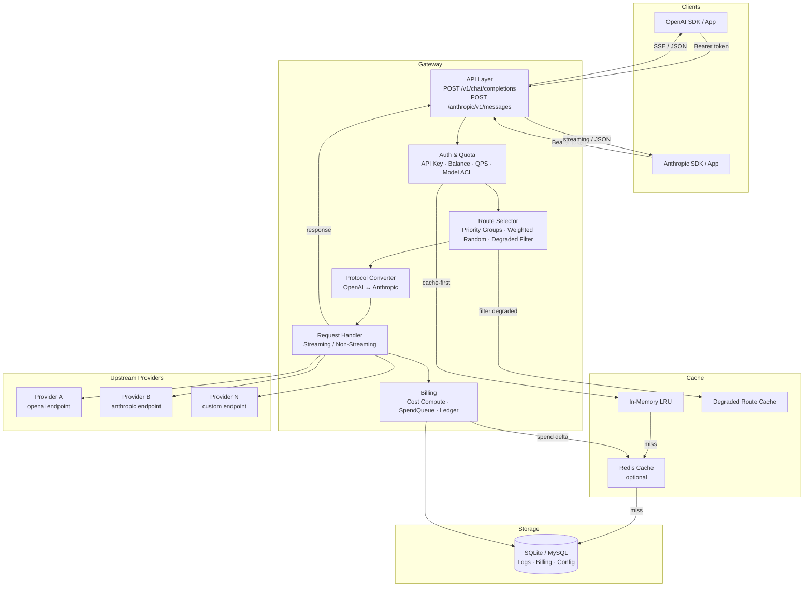

# llm-router Architecture

## Overview

`llm-router` is a lightweight, self-hosted LLM gateway built with Python. It supports two deployment scenarios:

- `local`: Single-node deployment using SQLite, zero external dependencies
- `server`: Multi-instance deployment using MySQL + Redis, designed for shared state and centralized management

The gateway exposes drop-in compatible endpoints:

- OpenAI `POST /v1/chat/completions`
- Anthropic `POST /anthropic/v1/messages`

Internal capabilities:

- Logical model to downstream provider routing with priority and weighted fallback
- API Key-level balance, daily budget, QPS, and model access control
- Per-request token usage and cost recording
- Optional per-key request/response content audit logging
- Admin panel, ledger, and request log queries
- **Cross-protocol conversion** — an OpenAI client request can be routed to an Anthropic backend provider, and vice versa

## System Architecture



## Core Concepts

### Logical Model

The model name exposed to callers. Clients only ever see the logical model name; the actual downstream provider is transparent.

Examples:

- `gpt-4o`
- `claude-sonnet`
- `deep-reasoner`

### Provider Model

A concrete upstream endpoint configuration, including:

- Dual endpoint support: `openai_endpoint` and/or `anthropic_endpoint` (each optional; at least one required)
- Upstream model name
- Encrypted upstream API key
- Per-million-token pricing: `input_token_price`, `output_token_price`, `cache_read_token_price`, `cache_write_token_price`
- Prompt cache support flag
- Timeout and active status

### Route

A mapping from a logical model to one or more provider models. Each route entry carries:

- `priority` — lower value = higher priority; providers are grouped by priority
- `weight` — within the same priority group, traffic is distributed proportionally by weight
- `is_fallback` — fallback routes are only tried after all main-group routes fail

## Protocol Boundary

The system supports **cross-protocol routing**:

- An OpenAI client request can be routed to a provider with only an Anthropic endpoint (converted via `protocol_converter`)
- An Anthropic client request can be routed to a provider with only an OpenAI endpoint (converted vice versa)
- Same-protocol forwarding remains the default when the matching endpoint is available

The router resolves the upstream protocol at request time by inspecting which endpoint is available on the selected provider. There are four handler combinations:

| Client Protocol | Upstream Protocol | Handler |
|---|---|---|
| OpenAI | OpenAI | `OpenAINonStream/StreamingHandler` |
| OpenAI | Anthropic | `OpenAIOverAnthropicNonStream/StreamingHandler` |
| Anthropic | Anthropic | `AnthropicNonStream/StreamingHandler` |
| Anthropic | OpenAI | `AnthropicOverOpenAINonStream/StreamingHandler` |

## Runtime Modes

### Local Mode

Designed for development, self-hosting, and low-cost single-node deployment.

- SQLite (`aiosqlite`) as default storage
- In-memory LRU cache only (no Redis)
- No external infrastructure required
- `redis_enabled = False`, `use_mysql = False`

### Server Mode

Designed for multi-instance deployment.

- MySQL (`asyncmy`) as shared database
- Redis for distributed cache and spend queue
- `redis_enabled = True`, `use_mysql = True`
- Redis is always optional — if unreachable, the gateway gracefully falls back to in-memory cache

## Request Lifecycle

A standard request flow through the system:

1. Receive OpenAI or Anthropic protocol request
2. Extract API key from `Authorization: Bearer` header
3. Validate API key status, balance, daily budget, QPS, and model access (cache-first)
4. Look up available routes for the logical model (cache-first, degraded-route-filtered)
5. Select a provider via weighted random within the highest-priority group
6. Resolve upstream protocol; apply cross-protocol conversion if needed
7. Forward request to upstream endpoint
8. Parse upstream usage (prompt/completion/cache/reasoning tokens)
9. Compute costs at price snapshot; deduct balance via async spend queue
10. Write request log, usage record, ledger entry, and daily summary
11. Return response to caller in the original client protocol format

On upstream failure:

- **429 / 403**: Route is immediately marked `quota_exhausted` in the degraded cache; move to next priority group without retry
- **Other 4xx**: Return error immediately, no retry
- **5xx**: Increment fail count; if threshold exceeded, mark route `unavailable`; retry within group up to `MAX_RETRY_PER_GROUP = 3` times

After all main groups are exhausted, fallback groups are tried with the same logic.

## Routing Strategy

### Priority Groups

Routes are partitioned into main groups and fallback groups, then sorted by priority (ascending). The gateway traverses groups in order:

```
Main group priority=1 → Main group priority=2 → ... → Fallback group priority=1 → ...
```

### Weighted Random Selection

Within a priority group, providers with `weight > 0` are selected via weighted random:

```python
r = random.randint(0, total_weight - 1)
# cumulative scan to pick winner
```

Providers with `weight = 0` are excluded from routing.

### Degraded Route Cache

Failed routes are tracked in a `DegradedRouteCache` (backed by `DualCache`). Degraded routes are excluded from candidate selection until their TTL expires or a recovery background task clears them.

Degraded states:

- `quota_exhausted` — 429/403 from upstream
- `unavailable` — repeated 5xx failures exceeding threshold

## Streaming

The gateway supports OpenAI SSE streaming and Anthropic streaming.

Streaming principles:

- Upstream event format is forwarded as transparently as possible
- OpenAI streaming requests automatically append `stream_options.include_usage=true` to obtain usage at stream end
- Anthropic streaming usage is extracted from upstream `message_delta` / `message_stop` events
- Billing and logging are written after the stream completes
- On stream interruption, a failed request log is recorded with available error context

## Dual Cache Architecture

The cache layer is a two-tier `DualCache`: `InMemoryCache` (always on) + `RedisCache` (server mode only).

```
Read: In-Memory → Redis (with backfill) → Database
Write: In-Memory + Redis (dual-write, Redis gated by is_available)
Invalidate: In-Memory + Redis (on every admin mutation)
```

### Cached Entities

| Cache Key Pattern | Content |
|---|---|
| `apikey:hash:{key_hash}` | API key metadata (status, balance, limits, allowed models) |
| `apikey:id:{id}` | Same, keyed by ID |
| `route:logical:{logical_model_id}` | Route list for a logical model |
| `provider:id:{id}` | Provider configuration (encrypted API key, pricing, endpoints) |
| `route:degraded:{route_id}` | Degraded state for a specific route |
| `route:degraded:set` | Set of all currently degraded route IDs |

All Redis keys are prefixed with `llm_router:cache:`.

### TTL Configuration

| Cache Layer | Default TTL |
|---|---|
| In-Memory | 60 seconds |
| Redis | 3600 seconds |

## Billing Model

Cost is computed per-request using per-million-token pricing:

```
non_cache_prompt_tokens = prompt_tokens - cache_read_tokens - cache_write_tokens
input_cost   = non_cache_prompt_tokens / 1_000_000 * input_token_price
output_cost  = completion_tokens       / 1_000_000 * output_token_price
cache_read_cost  = cache_read_tokens   / 1_000_000 * cache_read_token_price
cache_write_cost = cache_write_tokens  / 1_000_000 * cache_write_token_price
total_cost = input_cost + output_cost + cache_read_cost + cache_write_cost
```

Notes:

- `prompt_tokens` includes `cache_read_tokens` and `cache_write_tokens`; they are subtracted to avoid double-billing
- `reasoning_tokens` (for models like o1) are included in `completion_tokens` — tracked separately but not separately priced
- Prices are snapshotted at request time; subsequent price changes do not affect historical records

### Async Spend Queue

Balance deductions use a `SpendQueue` to avoid concurrent write conflicts in multi-instance deployments. Each request pushes a `SpendDelta` to the queue; a background worker flushes the queue to the database at a configurable interval (`spend_queue_flush_interval`, default 30 s). `UsageRecord`, `BalanceLedger`, and `DailyUsageSummary` are still written immediately.

## Quota and Access Control

Each API key can independently configure:

- Current balance
- Daily spend cap (`daily_budget_limit`) — resets automatically each day
- QPS limit
- Allowed logical model list
- Request content logging toggle
- Response content logging toggle
- Enabled/disabled status

Enforcement:

- Balance ≤ 0 → 402 Payment Required
- Daily budget exceeded → 402 Payment Required
- QPS exceeded → 429 Too Many Requests
- Model not in allowed list → 403 Forbidden

## Persistence Model

### `api_keys`

Stores API key hash, balance, quota configuration, rate limit, and logging policy.

### `logical_models`

Stores logical model name, description, routing strategy, and active status.

### `provider_models`

Stores upstream provider endpoints (OpenAI and/or Anthropic), encrypted API key, pricing, cache support, and timeout.

### `logical_model_routes`

Stores the mapping between logical models and provider models, including priority, weight, fallback flag, and route status.

### `request_logs`

Stores per-request metadata: protocol, call type, status code, latency, upstream request ID, error message, timestamps, and end-user identifier.

### `request_log_bodies`

Optional separate table for request/response content. Only populated when content logging is enabled for the API key. Stored separately to keep `request_logs` lightweight.

### `usage_records`

Stores token usage breakdown (prompt, completion, cache_read, cache_write, reasoning), price snapshots, and cost breakdown per request.

### `balance_ledgers`

Immutable transaction log for all balance changes (topup, charge, adjust, refund) with before/after snapshots.

### `daily_usage_summaries`

Per API key daily aggregates: request count, token counts, and total cost.

## Security Model

| Secret | Storage |
|---|---|
| Caller API key | SHA-256 hash only; plaintext never stored |
| Upstream provider API key | Fernet-encrypted at rest |
| Admin passwords | Hashed; stored in `admin_users.json` |
| Admin session | Signed session cookie (`SESSION_SECRET`) |

Required configuration:

- `APP_ENCRYPTION_KEY` — Fernet key for upstream API key encryption
- `SESSION_SECRET` — Secret for admin session cookies

## API Endpoints

| Method | Path | Protocol | Streaming |
|---|---|---|---|
| `GET` | `/v1/models` | OpenAI | — |
| `POST` | `/v1/chat/completions` | OpenAI | SSE |
| `POST` | `/anthropic/v1/messages` | Anthropic | streaming |

## Admin Surface

- Admin login (session-based)
- API Key: create, edit, top-up, disable
- Logical Model: create, edit
- Provider: create, edit, disable
- Route: create, edit, delete
- Request logs: list with filters, detail view
- Billing: ledger, usage records, daily summaries

Request and response content are not stored by default; they can be enabled per API key.

## Deployment Layout

```text
llm-router/
  src/llm_router/
    api/           # FastAPI route handlers (openai, anthropic, admin)
    core/          # Config, database, security
    domain/        # ORM models, schemas, enums
    services/
      cache/       # DualCache, InMemoryCache, RedisCache, DegradedRouteCache, SpendQueue
      non_stream_handlers/   # Non-streaming proxy handlers (native + cross-protocol)
      streaming_handlers/    # Streaming proxy handlers (native + cross-protocol)
      gateway.py             # Request orchestration and retry logic
      router.py              # Route resolution and weighted selection
      protocol_converter.py  # Bidirectional OpenAI ↔ Anthropic conversion
      billing.py             # Cost computation and recording
    templates/     # Jinja2 admin UI templates
  docker/
    local/         # SQLite Compose (zero dependencies)
    server/        # MySQL + Redis Compose + init.sql
  migrations/      # Alembic migration scripts
  tests/
  Dockerfile
```

## Current Capabilities

| Capability | Status |
|---|---|
| OpenAI `POST /v1/chat/completions` | Supported |
| Anthropic `POST /anthropic/v1/messages` | Supported |
| Non-streaming forwarding | Supported |
| Streaming forwarding (SSE / Anthropic) | Supported |
| Same-protocol routing | Supported |
| Cross-protocol routing (OpenAI ↔ Anthropic) | Supported |
| Priority-based routing with fallback | Supported |
| Weighted random traffic distribution | Supported |
| Degraded route detection and recovery | Supported |
| Per-key balance, daily budget, QPS control | Supported |
| Prompt cache billing (read + write) | Supported |
| Reasoning token tracking | Supported |
| Async spend queue for concurrent balance updates | Supported |
| Two-tier cache (In-Memory + Redis) | Supported |
| Optional table prefix | Supported |
| Redis distributed rate limiting | Not yet |
| Multi-tenant / fine-grained RBAC | Not yet |
| Advanced analytics / offline reporting | Not yet |
